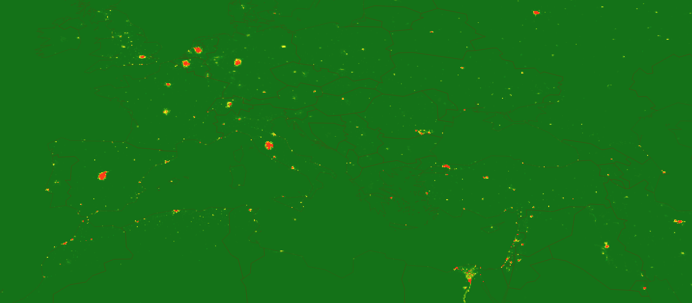
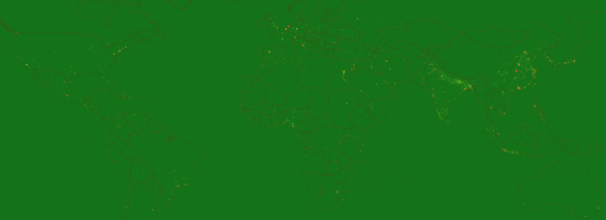

# covid-19-risk-map
Data, methods and code to develop Global Corona Virus (COVID19) risk maps. Work in progress.

# Disclaimer
This is a very simple methodology to assess hazard risks from COVID-19 in a geographical manner.  It is by no means accurate and the users should be aware of the simplification in the procedures and therefore it needs to be used with care.

Ideally, it should be reviewed by data scientists, geographical epidemiologists, other health professionals and policy makers to be adjusted for gaining some overall insights into the pandemic.

# The Logic

The logic is relatively simple and relies on the hazard risk approach. Basically, I am assuming the hazard risk = hazard magnitude x vulnerability.

We have some idea on the hazard magnitude, and it is some function of the current. The vulnerability on the other hand can be defined by the amount of people that is vulnerable to the disease, and it is some function of the population.

For the hazard component, I am using the confirmed cases and deaths collected across the world [1]. For the vulnerability component, I am using a 1km population grid [2]. I already downloaded the population grid, aggregated to 10 km resolution and included it in the repository [(ppp_2020_10km_Aggregated.zip)](ppp_2020_10km_Aggregated.zip)

My main logic is the following: Multiplication of confirmed cases and the population gives one risk measure (a). But since testing is not uniform across the world and I think the number of deaths might be more reliable, I multiply that with population for the second risk component (b). And finally, the larger the population is, the more risk it has at an exponential level even if there are no confirmed cases yet. That is why I squared the population to generate the third risk component (c). 

If you go into the program, you will notice that I scale each risk component between 0 and 1000, and then do the following calculation:
total risk = a + b + c/2
This really is a first attempt to quantify the risk and I acknowledge there are countless factors that should ideally go into this mapping (e.g. temperatures, connectivity and human flows, existing policies, type of medical system, economics, level of social isolation etc.). 

# Flow of the program

1.	The program reads all the constants and file names from the [covConst.py](covConst.py) file. The outcome of the program can be changed simply by changing the variables (such as the size of the low pass filter).
2.	The program [covid19RiskMap.py](covid19RiskMap.py) pulls the COVID 19 data from the COVID-19 (2019-nCoV) Data Repository by Johns Hopkins CSSE [1].
3.	Then it creates a shapefile containing the confirmed cases and deaths with their lat/long.
4.	Then it creates two rasters for both confirmed cases and deaths.
5.	Because the rasters are created with a relatively fine spatial resolution, I added a low pass filter using a Gaussian kernel on to these rasters for a more meaningful spatial distribution (basically distribute the confirmed cases and deaths to nearby pixels).
6.	During this process the geographical references disappear so I had to reassign them.
7.	The program adjusts the size of the population grid since the raster calculation is done by numpy, which means the arrays need to be in identical size.
8.	Each raster is read into a numpy array, and the calculations described above are carried out.
9.	The result is saved as a raster named “covid-risk.tif”.

# Visualization

For the screenshots I used ArcGIS Pro, but an open source solution like QGIS can be easily deployed, as well.  I am currently working on making the visualization on Jupyter Notebooks. Ideally the user would be able to zoom into portions of the final map.

# References and Sources
1. https://github.com/CSSEGISandData/COVID-19
2. Lloyd, C., Sorichetta, A. & Tatem, A. High resolution global gridded data for use in population studies. Sci Data 4, 170001 (2017). https://doi.org/10.1038/sdata.2017.1

# License

Copyright 2020 Naci Dilekli

Permission is hereby granted, free of charge, to any person obtaining a copy of this software and associated documentation files (the "Software"), to deal in the Software without restriction, including without limitation the rights to use, copy, modify, merge, publish, distribute, sublicense, and/or sell copies of the Software, and to permit persons to whom the Software is furnished to do so, subject to the following conditions:

The above copyright notice and this permission notice shall be included in all copies or substantial portions of the Software.

THE SOFTWARE IS PROVIDED "AS IS", WITHOUT WARRANTY OF ANY KIND, EXPRESS OR IMPLIED, INCLUDING BUT NOT LIMITED TO THE WARRANTIES OF MERCHANTABILITY, FITNESS FOR A PARTICULAR PURPOSE AND NONINFRINGEMENT. IN NO EVENT SHALL THE AUTHORS OR COPYRIGHT HOLDERS BE LIABLE FOR ANY CLAIM, DAMAGES OR OTHER LIABILITY, WHETHER IN AN ACTION OF CONTRACT, TORT OR OTHERWISE, ARISING FROM, OUT OF OR IN CONNECTION WITH THE SOFTWARE OR THE USE OR OTHER DEALINGS IN THE SOFTWARE.
